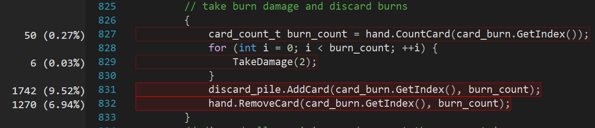
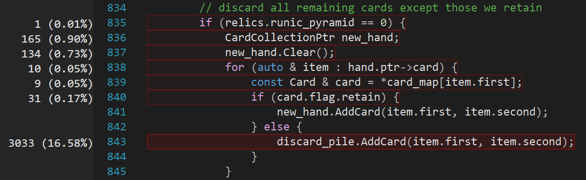
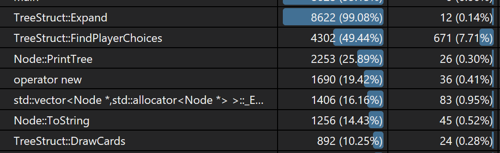
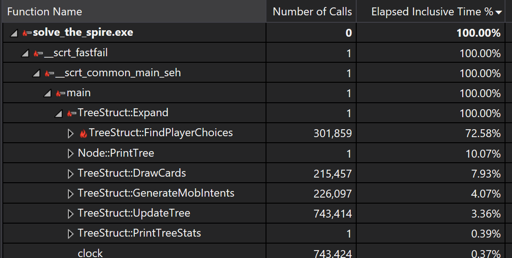
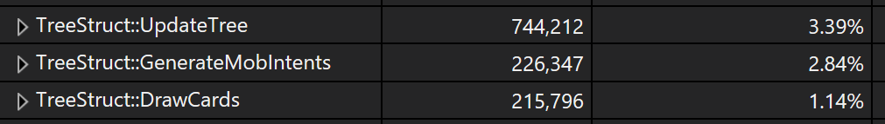

The previous optimizations for handling collections of cards helped quite a bit, but I notice there is still a lot of time spend managing decks by adding/removing cards.

In the EndTurn node, almost all time is spent in `CardCollectionPtr` routines. We can probably improve this significantly.

Oops, I'm calling stuff when I don't need to (`burn_count = 0`):

I can probably do this way more efficiently by avoid converting beween CardCollection and CardCollectionPtr except at the start and end of the function, and only if needed.

I did this, and the result was a 50% increase in speed. The standard Nob fight dropped from about 3.0 seconds to 1.5 seconds.

The new bottlenecks are FindPlayerChoices, EndTurn, DrawCards. Probably not too much we can do here, although DrawCards can be improved by using `CardCollectionPtr` instead of `CardCollection`.

Reworked selection of cards to draw to get time down to about 1.3 sec.

## Cache

Maybe it makes sense to cache the results of drawing cards. We spend about 8% of our time here.

This would dramatically speed up. Cache would be built off of CardCollectionPtr and number of cards to draw.

Yep, this sped up the overall by 5%, and reduced the time we spend in `DrawCards` quite a bit.

