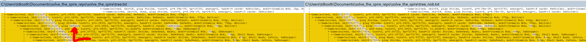

I changed some files and when I rerun the Nob fight, I get a much slower solve time (~about 11sec) compared to previously (about 3sec). I also get a more optimal fight
(final objective 34.6 instead of 30.8).

Examining the trees (new on left, old on right), I noticed that the new tree has a suboptimal strat in that it plays defend on the first turn when it has a strike in hand. Playing defend has no effect since Nob doesn't attack on turn one, while the strike can only help.



The solver should realize the node that ends with playing defend is strictly worse than the node that ends with playing strike, even if the play itself doesn't actually matter.

I will attempt to recreate.

I see the issue. The game isn't setting player block to 0 after end turn is pressed.
```
Game(maxobj=100, turn=1, p=1, hp=72/80, energy=3, hand={5 cards: 4xStrike, Defend}, mob0=(Gremlin Nob, 87hp, Bellow))
X Game(maxobj=100, end turn, turn=2, p=1, hp=72/80, to_draw=5, mob0=(Gremlin Nob, 87hp, 3xEnrage))
X Game(maxobj=100, end turn, turn=2, p=1, hp=72/80, to_draw=5, mob0=(Gremlin Nob, 81hp, 3xEnrage))
X Game(maxobj=100, end turn, turn=2, p=1, hp=72/80, to_draw=5, block=5, mob0=(Gremlin Nob, 87hp, 3xEnrage))
X Game(maxobj=100, end turn, turn=2, p=1, hp=72/80, to_draw=5, mob0=(Gremlin Nob, 75hp, 3xEnrage))
X Game(maxobj=100, end turn, turn=2, p=1, hp=72/80, to_draw=5, block=5, mob0=(Gremlin Nob, 81hp, 3xEnrage))
X Game(maxobj=100, end turn, turn=2, p=1, hp=72/80, to_draw=5, block=5, mob0=(Gremlin Nob, 81hp, 3xEnrage))
X Game(maxobj=100, end turn, turn=2, p=1, hp=72/80, to_draw=5, block=5, mob0=(Gremlin Nob, 75hp, 3xEnrage))
X Game(maxobj=100, end turn, turn=2, p=1, hp=72/80, to_draw=5, block=5, mob0=(Gremlin Nob, 75hp, 3xEnrage))
  Game(maxobj=100, end turn, turn=2, p=1, hp=72/80, to_draw=5, mob0=(Gremlin Nob, 69hp, 3xEnrage))
  Game(maxobj=100, end turn, turn=2, p=1, hp=72/80, to_draw=5, block=5, mob0=(Gremlin Nob, 75hp, 3xEnrage))
  ```

This is probably related to the functionality I added with barricade and calipers.

Yep, I had this:
```
        if (kBuffBarricade) {
        } else if (block > 15 && relics.calipers) {
            block -= 15;
        } else {
            block = 0;
        }
```
but should have had this:
```
        if (buff[kBuffBarricade]) {
        } else if (block > 15 && relics.calipers) {
            block -= 15;
        } else {
            block = 0;
        }
```

I fixed the bug. Now it correctly realizes playing 3x strike is the best play.
```
Game(maxobj=100, turn=1, p=1, hp=72/80, energy=3, hand={5 cards: 4xStrike, Defend}, mob0=(Gremlin Nob, 87hp, Bellow))
X Game(maxobj=100, end turn, turn=2, p=1, hp=72/80, to_draw=5, mob0=(Gremlin Nob, 87hp, 3xEnrage))
X Game(maxobj=100, end turn, turn=2, p=1, hp=72/80, to_draw=5, mob0=(Gremlin Nob, 81hp, 3xEnrage))
X Game(maxobj=100, end turn, turn=2, p=1, hp=72/80, to_draw=5, mob0=(Gremlin Nob, 87hp, 3xEnrage))
X Game(maxobj=100, end turn, turn=2, p=1, hp=72/80, to_draw=5, mob0=(Gremlin Nob, 75hp, 3xEnrage))
X Game(maxobj=100, end turn, turn=2, p=1, hp=72/80, to_draw=5, mob0=(Gremlin Nob, 81hp, 3xEnrage))
X Game(maxobj=100, end turn, turn=2, p=1, hp=72/80, to_draw=5, mob0=(Gremlin Nob, 81hp, 3xEnrage))
X Game(maxobj=100, end turn, turn=2, p=1, hp=72/80, to_draw=5, mob0=(Gremlin Nob, 75hp, 3xEnrage))
X Game(maxobj=100, end turn, turn=2, p=1, hp=72/80, to_draw=5, mob0=(Gremlin Nob, 75hp, 3xEnrage))
X Game(maxobj=100, end turn, turn=2, p=1, hp=72/80, to_draw=5, mob0=(Gremlin Nob, 75hp, 3xEnrage))
  Game(maxobj=100, end turn, turn=2, p=1, hp=72/80, to_draw=5, mob0=(Gremlin Nob, 69hp, 3xEnrage))
```

Now it agrees with the old optimal max objective of around 30.8.
